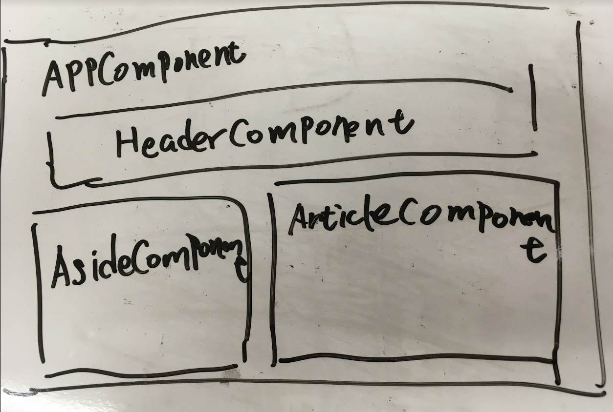

# Angular学習まとめ

UdemyのAngular学習コースで習得した内容を整理するためのメモである。

## Get Started

### Angularの特徴

- クロスプラットフォーム
  - PWA
  - Electron
- パフォーマンス
  - Code generation (AOT)
  - Universal
- 生産性
  - Templates
  - Angular CLI
  - IDE (Vscode)
- テストビリティ
  - Unit Test (Karma)
  - E2E Test (Protractor)
- [TypeScript](https://www.typescriptlang.org/index.html)
  - オブジェクト指向言語(Java, C#)できる人と親和性が高い
  - TypeScriptはあくまでサポート、JavaScriptできるに越したことない

### 環境構築

Windows 10 で作業を行う。事前に[chocolatey](https://chocolatey.org/)をインストールしておく。

#### chocolateyでインストール

```bash
## 開発環境と必要ツールインストール
choco install nodejs-lts notepadplusplus vscode git -y

## 自動更新のソフトをchocoから管理外にする
choco uninstall vscode --skip-autouninstaller
```

#### npmからAngular Cliをインストール

```bash
npm i -g @angular/cli
```

#### vscodeの拡張機能をインストール

- Angular Extension Pack

## Basic

### プロジェクト作成

```bash
## プロジェクト作成
ng new demo1

## 起動
cd demo1
npm start
```

### プロジェクト構造

```
demo1
├── angular.json (Angular設定ファイル)
├── browserslist
├── e2e (E2Eテスト)
│   ├── protractor.conf.js (E2Eテスト設定ファイル)
│   ├── src
│   │   ├── app.e2e-spec.ts
│   │   └── app.po.ts
│   └── tsconfig.json
├── karma.conf.js (Unitテスト設定ファイル)
├── package-lock.json
├── package.json (npm設定ファイル)
├── src
│   ├── app
│   │   ├── app-routing.module.ts
│   │   ├── app.component.css (CSS)
│   │   ├── app.component.html (HTML)
│   │   ├── app.component.spec.ts　(Unit Test Code)
│   │   ├── app.component.ts (Class)
│   │   ├── app.module.ts
│   │   └── page1
│   │       ├── page1.component.css
│   │       ├── page1.component.html
│   │       ├── page1.component.spec.ts
│   │       └── page1.component.ts
│   ├── assets (静的リソース)
│   │   ├── fonts
│   │   ├── images
│   │   ├── scripts
│   │   └── styles
│   ├── environments (環境変数)
│   │   ├── environment.prod.ts
│   │   └── environment.ts
│   ├── favicon.ico
│   ├── index.html
│   ├── main.ts
│   ├── polyfills.ts (古いブラウザ対応必要なときの設定ファイル)
│   ├── styles.css
│   └── test.ts
├── tsconfig.app.json
├── tsconfig.json
├── tsconfig.spec.json
└── tslint.json
```

### ModuleとComponent



### 基本コマンド

Component生成

```bash
ng generate component page1

## 簡略版
ng g c page2
```

発行

```bash
ng build

## 製品版(JavaScriptが圧縮される)
ng build --prod
```

[Angularのバージョンアップサイト](https://update.angular.io/)

```bash
## local angular
ng update

## global angular cli update
npm list -g --depth=0
npm outdated -g
npm i -g @angular/cli
```

## Data Binding

### Interprolation

`{{property}}`

- html

  ```html
  <p>{{title}}</p>
  ```

- ts

  ```ts
  export class AppComponent {
    title = 'demo1';
  }
  ```

### Property Binding

`[property]="statement"`

- html

  ```html
  <a [href]="url" [attr.data-title]="title">{{title}}</a>
  ```

- ts

  ```ts
  export class AppComponent {
    title = 'demo1';
    url = 'http://dongsu.dev/';
  }
  ```

### Event Binding

`(click)="method()"`

- html

  ```html
  <button (click)="doCancel()">Cancel Edit</button>
  ```

- ts

  ```ts
  export class AppComponent {
    doCancel() {
      // Dosomething
      this.isEdit = false;
    }
  }
  ```

### Two-way Binding

`[(ngModel)]="Property"`

- html

  ```html
   <input type="text" size="70" [(ngModel)]="item.title" >
  ```

- ts(app.module.ts)

  ```ts
  import { FormsModule } from '@angular/forms';

  @NgModule({
  imports: [
    CommonModule,
    FormsModule
  ]
  })
  ```

- ts(app.component.ts)

  ```ts
  export class AppComponent {
    item;
  }
  ```

### Template Reference variables

HTMLの任意のタグで`#name`をつけることでタグ配下の要素を取得できたり、
Component配下のObjectをアクセスできる。

- html

  ```html
  <app-header #tHeader></app-header>

  <p (click)="#tHeader.title = 'Title Changed'">Click Me</p>
  ```

## Directives

### Component Directives

Componetごとのcssは独立しており、タグでスタイルを定義しても他のComponentのスタイルに影響はない。やろうと思えば、以下のやり方でスタイル全体適用は可能。

- ts

  ```ts
  @Component({
    styleUrls : ['./footer.component.css'],
    encapsulation : ViewEncapsulation.None
  })
  ```

### Attribute Directives

#### ngClass

動的にスタイルを変更させる。
`[ngClass]="bool値"`

- html
  
  ```html
  <h3 [ngClass]="{'highlight' : counter %2 ==0}">Hello</h3>
  <h3 [class.highlight]="{counter %2 ==0}">Hello</h3>
  ```

#### NgIf

動的にタグの存続状態を変化させる
`*ngIf="bool値"`

- html
  
  ```html
  <div *ngIf="counter %2 ==0">
    <!-- ここ配下全部消える-->
    <h1>H1</h1>
    <h1>H1</h1>
    <h1>H1</h1>
  </div>
  ```

#### NgSwitch

動的にタグをCase文で制御する
`[ngSwitch] = {条件}`
`ngSwitchCase={ケース}`

- html

  ```html
  <ng-container [ngSwith] = "counter % 2">
    <ng-container *ngSwitchCase="0">Output0</ng-container>
    <ng-container *ngSwitchCase="1">Output1</ng-container>
    <ng-container *ngSwitchDefault>N/A</ng-container>
  </ng-container>
  ```

`div`じゃなく`ng-container`にした理由は余計なHTMLタグを生成されず、レイアウトを崩さないため

#### NgFor

繰り返し処理
`*ngFor = ley item of data`

- html

  ```html
  <article class="post" id="post{{idx}}" *ngFor="let item of data; let idx=index">
    <app-article-header [item]="item" (delete)="doDelete($event)" (titleChanged)="doModify($event)">
    </app-article-header>
    <app-article-body [item]="item" [counter]="counter"></app-article-body>
  </article>
  ```

## Module

機能ごとModule分割するのがベストプラクティスです。

```bash
ng g m {module name} -m {}
```

既存のModuleにfeature Moduleを追加する。

```bash
ng g m {module name} -m {既存module name}
```

feature Componentの作り方

```bash
cd src
cd app
cd {feature module folder name}
ng g c {componet name}
```

app で使うfeature component は fearter moduleでexportsを入れることを忘れなく

```ts
@NgModule({
  exports: [{componet name}],
})
```

componentのData受け渡し

### Input

- ts

  ```ts
  @Input()
  item;
  ```

- html

  ```html
  <app-body [item]="item"></app-body>
  ```

### Componentのライフサイクル

1. `constructor` : クラスのインスタンス生成時に呼ばれる。基本DI用途しか使わない
2. `ngOnChanges` : `@Input`のプロパティに変更があった場合に触発する
3. `ngOnInit` : インスタンス生成後。プロパティの初期値を設定したり、Ajax実行してサーバーからデータ取得し、画面表示させたりする用途。
4. `ngOnDestroy` : 最後に呼ばれる。オブジェクトの破棄で使う。ほぼ使わない。

### Output

イベントとプロパティを定義

- 子Component

  ```ts
  // 発火
  @Output()
  delete = new EventEmitter<any>();

  deleteArticle() {
    this.delete.emit(this.item);
  }
  ```

  ```html
  <button (click)="deleteArticle()">Delete</button>
  ```

- 親Component

  ```ts
  doDelete(item) {
    this.data.filter((v)=>{
      return v !== item;
    });
  }
  ```

  ```html
  <app-article-header [item]="item" (delete)="doDelete($event)">
  </app-article-header>
  ```

### 単一方向データフロー

子Componentでなるべくデータを変更しない思想の設計である。

子Component内で`[(ngModel)]`を使って直接データ変更でき、楽に実装できるが、Component同士の依存性は強くなり将来的にメンテナンスしにくくなる。

- 子Component

  ```ts
  @Output()
  titleChanged = new EventEmitter<any>();

  doEdit(title) {
    this.newTitle = title;
    this.titleChanged.emit({id : this.item.id, title: title});
  }
  ```

  ```html
  <input type="text" [value]="item.title" (keyup.enter)="doEdit($event.target.value)">
  ```

- 親Component

  ```ts
  doModify($event : any) {
    this.data = this.data.map((item) => {
        if (item.id == $event.id) {
          // 新しいObjectを返す
          return Object.assign({}, item, $event);
        }
        return item;
      });
  }
  ```

  ```html
  <app-article-header [item]="item" (titleChanged)="doModify($event)">
  </app-article-header>
  ```

### ngOnChangesライフサイクルHook

`@Input`のプロパティに変更があった場合に触発する。

```ts
ngOnChanges(changes : any) {
  if (changes.item) {
    // 変更前のオブジェクトを保管できる
    this.orig_item = changes.item.currentValue;
    // 新しいオブジェクト
    this.item = Object.assign({}, changes.item.currentValue);
  }
}

doEdit() {
  this.titleChanged.emit(this.item);
}
```

```html
<input type="text" [(ngModel)]="item.title" (keyup.enter)="doEdit()">
```

## Service

コマンドからServiceを生成

```bash
ng g s {service name}
```

Module内でServiceを注入する

```ts
@NgModule({
  providers: [DataService]
})
```

ComponentでDIして利用する

```ts
datasvc : DataService;
constructor(datasvc: DataService) {
  this.datasvc = datasvc;
}

// こっちのほうがスマート（htmlでserviceを使いたい場合はpublicにすればいい）
constructor(private datasvc: DataService) {
}
```

## Observable async

Observableのsubscribeを省略できる

- Service

  ```ts
  getData() {
    return this.http.get('http://localhost:4200/api/articles.json');
  }
  ```

- Component

  ```ts
  // Observableオブジェクトは後ろに$をつけるのが一般的
  data$ : Observable<any>;

  ngOnInit() {
    this.data$ = this.datasvc.getData();
  }
  ```

  ```html
  <div *ngFor="let item of data$|async;"></div>
  ```
